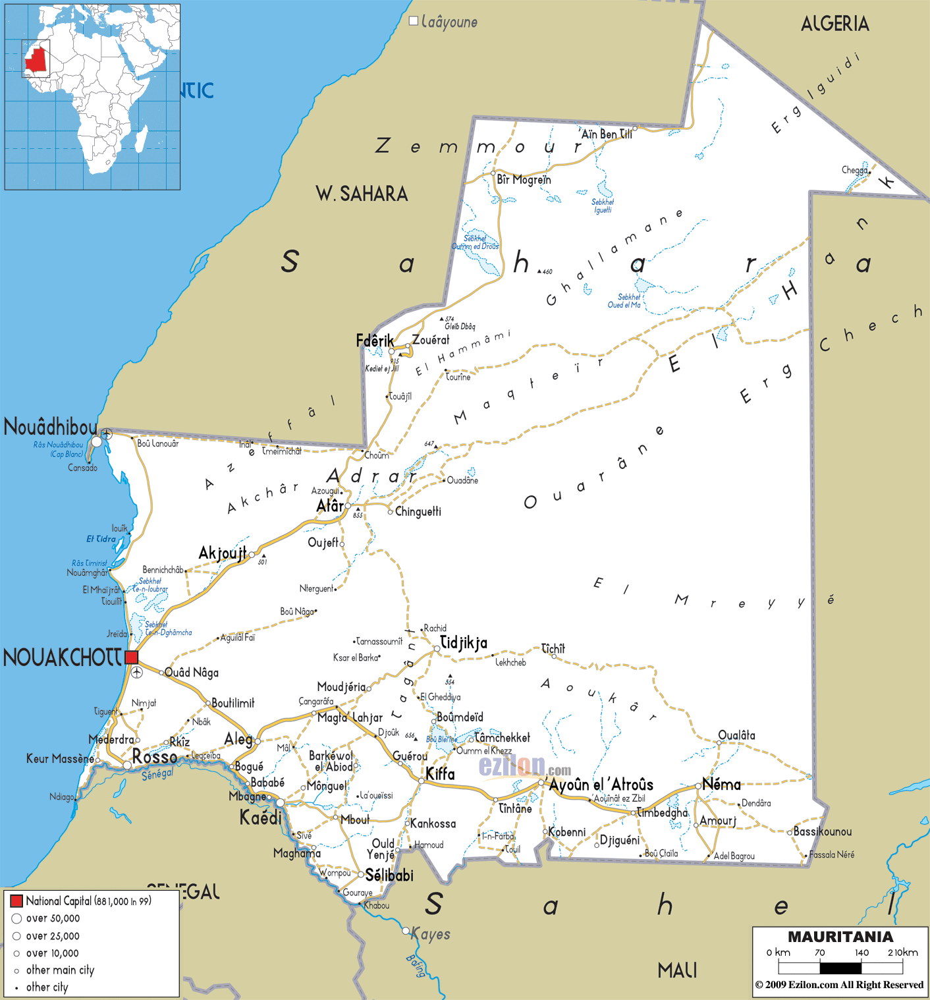

# Mauritania (~Jan 28 -- Jan 31 2026)
*   **Start Date**: ~Jan 28, 2026
*   **End Date**: ~Jan 31, 2026
*   **Duration**: ~4 Days
*   **Distance**: ~750 km
*   **Drive Load**: ~8-12 Hours/Day
*   **Visa**: **E-VISA REQUIRED IN ADVANCE**.
*   **Weather**: **Desert Climate**. Hot Days (25-30°C) / Cool Nights (14°C). Dry. Strong winds/sandstorms possible.

## 1. Pre-Entry Prep
*   **Visa**: **E-VISA REQUIRED IN ADVANCE**. No longer available at border. Bring 2 colour copies.
    *   *Application*: Address field: "Travelling with Dahid Jdeidou of Levrigue Agence".
    *   *Warning*: **DO NOT USE THE WORD 'RALLY'** on the application.
*   **Meeting Point**: **Hotel Barbas** (Morocco side). Leave at 6:00 AM on **Jan 28th** to hit border early.
*   **Supplies**:
    *   **Alcohol**: **STRICTLY PROHIBITED**. Dry country. 
        *   *Risk*: Fines up to **€100 per bottle** if found. Decant/Hide well or don't bring.
    *   **Fuel**: Fill tank and jerry cans at Barbas (cheap/good quality). Mauritanian fuel is expensive and low octane.
*   **Documents**: Colour copies of Passport, V5, E-Visa for the fixer (Dahid).

## 2. Route & Driving Conditions
*   **Border Crossing (Guerguerat)**:
    *   **No Man's Land**: 300m strip between borders. **Stay on the track**. Area is mined.
    *   **Fixer**: Dahid will meet the group. Follow his instructions.
    *   **Fees (Cash Euros)**:
        *   Visa: ~55 €
        *   Insurance: ~30 €
        *   Passavant: ~10 €
        *   Tourist Tax: ~10 €
*   **Road vs. Desert**:
    *   **Decision**: You must choose "Desert" or "Road" group.
    *   **Road Route**: N2 to Nouakchott. Tarmac is generally good but has a battered section.
    *   **Desert Route**: **GUIDE ESSENTIAL** (Dahid). Sand ladders/4x4 required. Dinner provided (BBQ). **Camping Only** (1 night).
*   **Hazards**:
    *   **Mines**: Small piles of rocks near the road indicate mines. **DO NOT LEAVE TARMAC** for toilet stops without checking.
    *   **Heat**: Carry double the water you think you need.
    *   **Police Scam**: Nouakchott traffic lights. Police wave you through a red light then fine you. **DO NOT MOVE UNTIL GREEN**.

## 3. Required Stops
*   **Nouakchott**:
    *   **Meeting Point**: Roundabout near American Embassy (09:00/09:30 AM).
    *   **Date**: **Jan 31st**.
    *   **Objective**: Convoy to Diama border.
*   **Fuel/Tyre Stop**: "Red Petrol Station" en route to Diama. Last chance to fix cars/buy water (20 min limit).

## 4. Safety & Culture (Practical)
*   **Currency**: Ouguiya. Closed currency. Change at border.
*   **Religion**: Conservative Muslim. Modest dress recommended.
*   **Alcohol**: Zero tolerance.

## 5. Pre-Exit Checklist
*   **Convoy**: MUST travel to Diama border as a group.
*   **Route**: **DO NOT GO TO ROSSO**. Follow the convoy to **Diama** (National Park route).

## Fun Things to Do
*   **Banc d'Arguin National Park** [Nature]
    *   *Description*: A UNESCO World Heritage site teeming with migratory birds.
    *   *Logistics*: Accessible via Iwik, off the main N2 road.
    *   *Media*: [Article: Lonely Planet Banc d'Arguin](https://www.lonelyplanet.com/mauritania/attractions/parc-national-du-banc-d-arguin/a/poi-sig/1301584/355448)

*   **Terjit Oasis** [Adventure]
    *   *Description*: A lush palm oasis in a canyon with swimmable pools.
    *   *Logistics*: Deep in the Adrar region (Atar). **Significant Detour** from coastal route. Requires planning.
    *   *Media*: [Article: Guide to Visiting Terjit](https://igoa-adventure.com/a-guide-to-visiting-terjit-oasis-in-mauritania/)

*   **Iron Ore Train** [Adventure]
    *   *Description*: The longest train in the world. You can ride the ore hoppers through the desert.
    *   *Logistics*: Departs from Nouadhibou. Hardcore adventure.
    *   *Media*: [Article: Mauritania Iron Ore Train](https://www.sophiesworld.net/oases-sanctuaries-sahara-mauritania/)

## Recommended Route Adjustments
*   **Coastal Focus**: Stick to the N2 unless you have a guide for the desert. The Banc d'Arguin is the most accessible nature stop without going fully off-grid.

## Appendix: Route Maps
| Mauritania Road Map |
| :---: |
|  |

## Appendix: Emergency & Medical
*   **Emergency**: **117** (Police) | **118** (Fire) | **101** (Traffic Police)
*   **Key Hospital (Nouakchott)**: **Clinique Kissi** (Private) or **Centre Hospitalier National**.
*   **US Embassy (Nouakchott)**: +222 4525-2660 | After Hours: +222 3662-8163
*   **UK Embassy**: No Consular Services in Nouakchott. Contact Rabat (+212 537 633 333) or London.
*   **NZ Assistance**: No Embassy. **24/7 Emergency**: +64 99 20 20 20
*   **NL Honorary Consul (Nouakchott)**: +222 45 25 24 82 | **24/7 Emergency**: +31 247 247 247
*   **FR Embassy (Nouakchott)**: +222 45 29 96 99 | **Emergency (Nights/Weekends)**: +222 45 29 95 15
