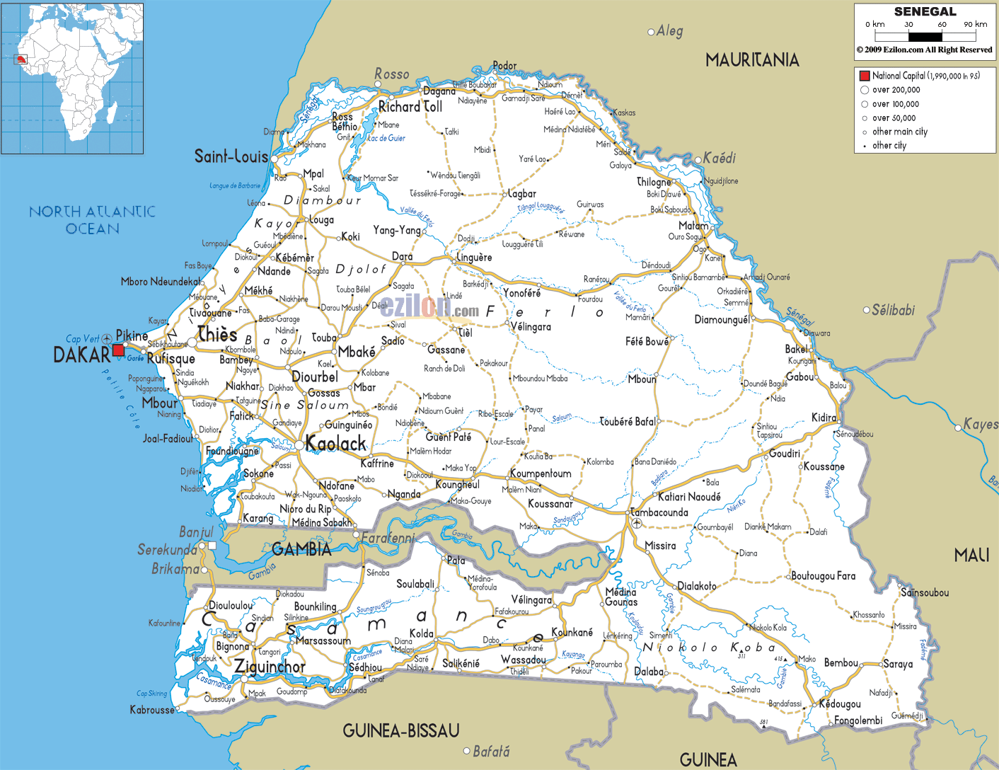

# Senegal (~Jan 31 -- Feb 2 2026)
*   **Start Date**: ~Jan 31, 2026
*   **End Date**: ~Feb 2, 2026
*   **Duration**: ~3 Days
*   **Distance**: ~400 km
*   **Drive Load**: ~6-8 Hours/Day
*   **Visa**: Visa-free (<90 days). "Senegal 1 Car Pass" required.
*   **Weather**: **Tropical Dry**. Hot (30-33°C) / Mild Nights (16°C). Dusty (Harmattan winds).

## 1. Pre-Entry Prep
*   **Mandatory Border**: **DIAMA** (via Diwaling National Park). **AVOID ROSSO** (Banditry/Corruption).
*   **Paperwork**: "Senegal 1 Car Pass" (~170 €).
    *   *Status*: **Mandatory Pre-Payment** (usually Sendwave/Bank Transfer). List closes Nov/Dec.
    *   *Function*: Allows vehicles >7 years old to enter without massive duties. Includes Passavant + Insurance.
*   **Convoy**: Must cross as a single group to use the Car Pass agreement.
*   **Mandatory Kit**: **Fire Extinguisher**. Police checks are frequent and they often ask for this (and triangles).

## 2. Route & Driving Conditions
*   **The Diama Road**:
    *   **Condition**: "Hideous and Awesome". Potholes, mud (if wet), dust gullies.
    *   **Technique**: Leave space for visibility. If dry, track alongside the road might be better.
*   **Main Roads**:
    *   **Hazard**: **SPEED BUMPS**. Massive, unpainted "launch ramps". Often marked by boulders/logs on the side.
    *   **Corrupt Police**: Watch for aggressive stops (e.g., Thies). Do not hand over original documents if possible. Use copies.
*   **Navigation**:
    *   Do not follow SatNav blindly leaving Diama (avoids mud bath). Follow instructions: Straight until Y-junction, then Right.

## 3. Required Stops
*   **Zebrabar (Rao/St Louis)**:
    *   **Date**: **Jan 31st / Feb 1st**.
    *   **Status**: Legendary Mandatory rest/repair stop.
    *   **Camping**: **No Booking Needed**. Unlimited space.
    *   **Facilities**: Ramps, mechanic, showers, cold beer (honesty bar).
    *   **Payment**: Cash (CFA/Euro) or Sendwave app.
*   **Route to Gambia**:
    *   Leave Zebrabar early **Feb 2nd**. Meet at **Karang Border** by 12:00 Midday.

## 4. Safety & Culture (Practical)
*   **Currency**: CFA (West African Franc). Linked to Euro.
*   **Culture**: More liberal dress code than Mauritania. Vibrant.
*   **Fuel**: Cheaper than Mauritania. Fill up near Zebrabar.

## 5. Pre-Exit Checklist
*   **Customs**: Must "sign out" vehicle from Senegal to enter Gambia.
*   **Group Exit**: Must cross Karang border together to adhere to the car pass rules.

## Fun Things to Do
*   **Saint-Louis Jazz & Colonial Charm** [Cultural]
    *   *Description*: The former capital with colorful colonial architecture and a vibrant music scene.
    *   *Logistics*: Just south of the Diama border.
    *   *Media*: [Article: 10 Things to do in Saint Louis](https://igoa-adventure.com/things-to-do-in-saint-louis-senegal/)

*   **Djoudj National Bird Sanctuary** [Nature]
    *   *Description*: One of the world's most important bird sanctuaries (pelicans/flamingos).
    *   *Logistics*: ~60km north of St Louis. Can be done en route from Diama if timing allows.
    *   *Media*: [Article: Visiting Djoudj](https://scootwestafrica.com/visiting-djoudj-bird-sanctuary-senegal/)

*   **Zebrabar Campsite** [Relaxation]
    *   *Description*: A legendary overlander stop in the Langue de Barbarie National Park.
    *   *Logistics*: Just south of Saint Louis.

## Recommended Route Adjustments
*   **Diama over Rosso**: This is a mandatory adjustment for safety/logistics, but also offers better scenery (wetlands/warthogs) vs the chaos of Rosso.

## Appendix: Route Maps
| Senegal Road Map |
| :---: |
|  |

## Appendix: Emergency & Medical
*   **Emergency**: **17** (Police) | **18** (Fire) | **1515** (Ambulance/SAMU)
*   **Key Hospital (Dakar)**: **Hôpital Principal de Dakar** or **Clinique de la Madeleine**.
*   **Key Hospital (St Louis)**: **Centre Hospitalier Régional de Saint-Louis**.
*   **US Embassy (Dakar)**: +221 33-879-4000 | After Hours: +221 33-879-4444
*   **UK Embassy (Dakar)**: +221 33 823 7392
*   **NZ Assistance**: No Embassy. **24/7 Emergency**: +64 99 20 20 20
*   **NL Embassy (Dakar)**: +221 33 829 21 21 (24/7 contact via +31 247 247 247 if needed)
*   **FR Consulate General (Dakar)**: +221 33 839 52 62 | **Emergency (Nights/Weekends)**: +221 33 839 51 09
