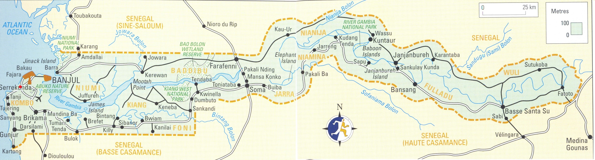

# The Gambia (Feb 5 -- Feb 11 2026)
*   **Start Date**: **Feb 5, 2026**
*   **End Date**: **Feb 11, 2026** (Check-out)
*   **Duration**: ~6 Days
*   **Distance**: ~25 km (Border to Ferry/Capital)
*   **Drive Load**: ~4-6 Hours/Day
*   **Visa**: Check VOA status. Likely required.
*   **Weather**: **Hot**. Highs ~34°C / Lows ~19°C. Humid but dry season.

## 1. Pre-Entry Prep
*   **Border**: **Karang**. Meet at 12:00 Midday on **Feb 5th**.
*   **Visa**: Check current status (VOA vs Advance).
*   **Cash**: Keep ~11,000 CFA (Senegal currency) for the Barra Ferry ticket (they don't accept Dalasi or Euro usually).

## 2. Route & Driving Conditions
*   **The Crossing**:
    *   **Option A (Preferred)**: **Barra Ferry**. Quickest route to Banjul. Unreliable/Sporadic. Chaos at ticket office.
        *   *New Option*: Private ferry "**Ngemarr**" might be running. Can take whole team in one load.
    *   **Option B (Backup)**: **Farafeni Bridge**. Long detour (70km from Kaolack). Bridge toll (~5€).
*   **Driving**:
    *   Zero tolerance on drink driving.
    *   Checkpoints frequent for right-hand drive cars (non-local plates).

## 3. Required Stops
*   **Finish Line**: **Bakadaji Hotel** (Serrekunda).
    *   **Check-in**: **Feb 5th** (15:00 GMT).
    *   **Check-out**: **Feb 11th** (11:00 GMT).
    *   **Status**: Confirmed Booking.
    *   **Official Finish Line**: Feb 6th (Usually).
    *   **Car Handover**: Occurs here or nearby.

## 4. Vehicle Handover (End Game)
*   **Procedure**:
    *   Handover to **Rotary Club (Sam)**.
    *   **DO NOT** sell/donate car privately (Customs will seize it/fine you).
    *   **DO NOT** leave car at airport (Security risk/Fines).
    *   **Documents**: Hand over keys and V5. Remove personal plates if desired.
        *   *UK Teams*: Retain V5 slip to notify DVLA of export.
    *   **Clearance**: Ensure car is stamped out of passport before flying.
*   **Auction**: Held on the Saturday after arrival.

## 5. Exit Logistics
*   **Flights**: Direct to London via Titan Airways (Gambia Experience).
    *   *Discount*: Check for code `5CHALLENGE`.
    *   *Dates*: Usually 7th or 10th Feb.
*   **Currency**: Dalasi. Cash economy. ATMs unreliable.

## Fun Things to Do
*   **Kachikally Crocodile Pool** [Adventure]
    *   *Description*: A sacred pool where you can get up close (and touch!) crocodiles.
    *   *Logistics*: Located in Bakau.
    *   *Media*: [Article: Visiting Sacred Crocodile Pools](https://perchancetoroam.com/2025/04/26/visiting-the-gambias-sacred-crocodile-pools/)

*   **Bijilo Forest Park (Monkey Park)** [Nature]
    *   *Description*: A small reserve famous for its friendly Green Monkeys and Red Colobus monkeys.
    *   *Logistics*: Near the Senegambia strip.
    *   *Media*: [Article: Top Things to Do in Gambia](https://www.viator.com/Gambia/d22232)

*   **Albert Market** [Cultural]
    *   *Description*: A bustling, chaotic market in Banjul perfect for souvenirs and local life.
    *   *Logistics*: In the capital, Banjul.

## Recommended Route Adjustments
*   **Ferry vs Bridge**: Taking the **Barra Ferry** lands you right in the heart of the action (Banjul) and is an experience in itself. The bridge is safer/boring but dumps you further inland.

## Appendix: Route Maps
| Gambia Road Map |
| :---: |
|  |

## Appendix: Emergency & Medical
*   **Emergency**: **117** (Police) | **118** (Fire) | **116** (Ambulance)
*   **Key Hospital (Banjul)**: **Edward Francis Small Teaching Hospital** or **Africmed International Hospital** (Private).
*   **US Embassy (Banjul)**: +220 439-2856 | After Hours: +220 437-2856 x2466
*   **UK Embassy (Banjul)**: +220 4495 133
*   **NZ Assistance**: No Embassy. **24/7 Emergency**: +64 99 20 20 20
*   **NL Honorary Consul (Banjul)**: +220 586 07 00 | **24/7 Emergency**: +31 247 247 247
*   **FR Representation**: No Embassy in Banjul. Covered by **Dakar Consulate**: +221 33 839 52 62.
